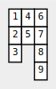
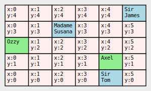

# GridView

Visualize your 2D iterable.

## Usage examples

### Simple

```python
from gridview import GridView

grid = [[1,2,3], [4, 5], [6, 7, 8, 9]]

GridView(grid).save('simple.svg')
```

Resulting image:



### Customized

```python
from gridview import GridView

grid = [
    ['Month', 'Cost', 'Notes'],
    ['January', 12.33],
    ['February', 33.10],
    ['March', 54.30, 'Delayed.'],
    ['April', 22.12],
    ['May', 31.41],
    ['June', 41.36, 'Delayed.'],
    ['July', 22.23, 'Lost!'],
    ['August', 82.10],
    ['September', 20.01, 'Replaced.'],
    ['October', 55.20],
    ['November', 34.23],
    ['December', 33.52]]

class Report(GridView):
    transpose = True

    def text(self, e, x, y):
        if x == 1 and y > 0:
            return f'${e}'

    def color(self, e, x, y):
        if y == 0:
            return 'lightgray'
        if x == 0:
            return 'lightyellow'
        if x == 1:
            if e > 50:
                return '#8888ff:too high'
            if e < 20:
                return '#ffff88:too low'
        if x == 2:
            if e.endswith('!'):
                return '#ff8888'

Report(grid).save('customized.svg')
```

Resulting image:


### Object Oriented

```python
from gridview import GridView

class Animal:
    def __init__(self, name):
        self._name = name
        
    def __str__(self):
        return self._name
        
    def color(self):
        return 'lightgreen'
        
class Person:
    def __init__(self, name, *, male):
        self._name = name
        self._male = male

    def __str__(self):
        title = 'Sir' if self._male else 'Madame'
        return f'{title}\n{self._name}'

    def color(self):
        return 'lightblue'

grid = [[None]*5 for n in range(6)]
grid[0][2] = Animal('Ozzy')
grid[4][1] = Animal('Axel')
grid[2][3] = Person('Susana', male=False)
grid[4][0] = Person('Tom', male=True)
grid[5][4] = Person('James', male=True)

class Report(GridView):
    flip_y = True
    default_color = '#ffeeee'

    def color(self, e, x, y):
        return e.color()
    
    def text(self, e, x, y):
        if e is None:
            return f'x:{x}\ny:{y}'

Report(grid).save('object_oriented.svg')
```

Resulting image:


